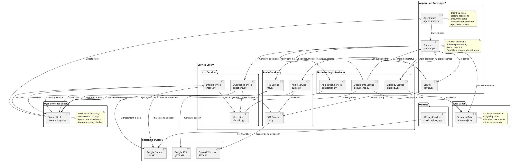

# System Architecture

## Architecture Diagram (PlantUML)



## Component Details

### 1. User Interface Layer
- **streamlit_app.py**: Main Streamlit application
  - Handles voice recording
  - Displays conversation history
  - Shows agent state in sidebar
  - Auto-processes recordings
  - Auto-plays responses

### 2. Application Core Layer

#### AgentState (agent_state.py)
- Manages conversation memory
- Tracks intent and slots
- Handles contradictions
- Stores document state
- Tracks application status

#### Planner (planner.py)
- Implements decision table
- Pre-filters candidate schemes
- Determines next action
- Manages conversation flow

#### Config (config.py)
- Centralized configuration
- Audio recording parameters
- Silence detection thresholds
- Language settings

### 3. Service Layer

#### Audio Services
- **audio.py**: Microphone recording, silence detection
- **stt.py**: Speech-to-text using Whisper
- **tts.py**: Text-to-speech using gTTS

#### NLU Services
- **intent.py**: Intent and slot extraction using Gemini
- **nlu_utils.py**: Yes/no extraction from Tamil
- **questions.py**: Tamil question generation

#### Business Logic Services
- **eligibility.py**: Deterministic eligibility checking
- **documents.py**: Document readiness tracking
- **application.py**: Mock application submission

### 4. Data Layer
- **schemes.json**: Scheme definitions, rules, required documents

### 5. External Services
- OpenAI Whisper (STT)
- Google Gemini (LLM)
- Google TTS (gTTS)

## Data Flow

```
User Voice Input
    ↓
[Audio Recording] → audio.py
    ↓
[STT] → stt.py → Whisper API
    ↓
[Text + Confidence]
    ↓
[NLU] → intent.py → Gemini API
    ↓
[Intent + Slots]
    ↓
[Update Memory] → agent_state.py
    ↓
[Planner Decision] → planner.py
    ↓
[Execute Action]
    ├─→ Eligibility Check → eligibility.py
    ├─→ Document Check → documents.py
    ├─→ Ask Question → questions.py
    └─→ Apply Scheme → application.py
    ↓
[Generate Response]
    ↓
[TTS] → tts.py → gTTS API
    ↓
[Audio Output] → Auto-play
```

## Key Design Patterns

1. **Service Layer Pattern**: Separation of concerns with dedicated service modules
2. **State Management**: Centralized agent state for conversation memory
3. **Deterministic Planning**: Rule-based planner without LLM decisions
4. **Context-Aware Processing**: Document/application responses bypass normal flow
5. **Modular Architecture**: Each component has a single responsibility

## File Organization

```
app/
├── __init__.py              # Package initialization
├── streamlit_app.py         # Main UI application
├── agent_state.py           # Conversation memory
├── planner.py               # Decision logic
├── config.py                # Configuration
├── schemes.json             # Scheme data
├── check_api_key.py         # API key verification
└── services/
    ├── __init__.py
    ├── audio.py             # Audio recording
    ├── stt.py               # Speech-to-text
    ├── tts.py               # Text-to-speech
    ├── intent.py            # Intent extraction
    ├── nlu_utils.py         # NLU utilities
    ├── questions.py         # Question generation
    ├── eligibility.py       # Eligibility engine
    ├── documents.py         # Document tracking
    └── application.py       # Application submission
```

