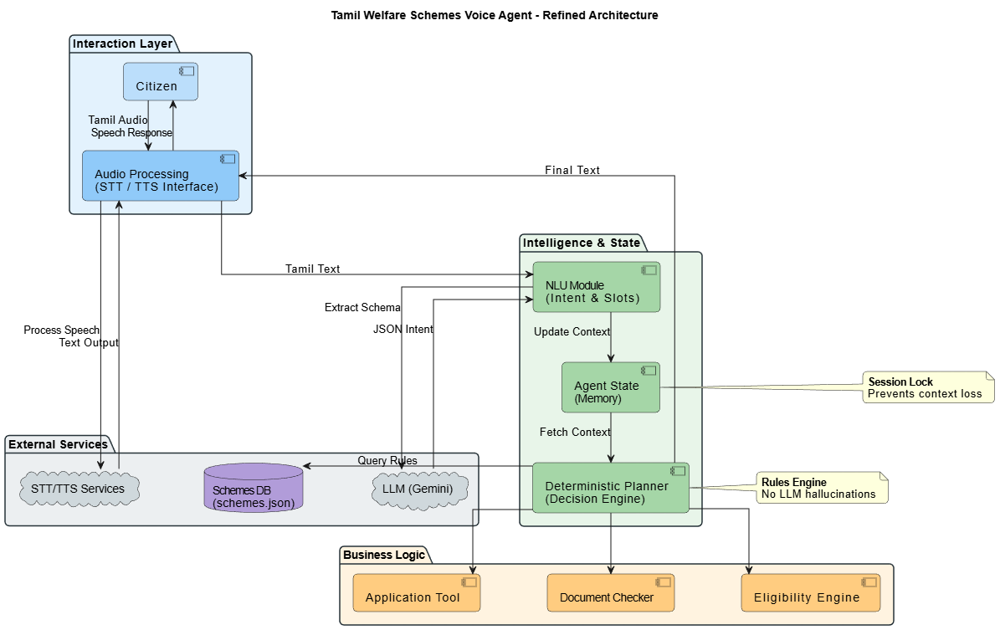

# Tamil Welfare Voice Agent - Complete Agentic System

A voice-first, agentic AI system that helps users identify and apply for government welfare schemes in Tamil. The system demonstrates autonomous reasoning, planning, tool usage, memory, and failure handling.

## Features

✅ **Voice-first interaction** - Voice input and output in Tamil  
✅ **Agentic workflow** - Planner-Executor-Evaluator loop with deterministic decision-making  
✅ **Memory & Contradiction handling** - Remembers context and resolves conflicts  
✅ **Eligibility engine** - Deterministic rule-based scheme eligibility checking  
✅ **Document readiness** - Checks required documents before application  
✅ **Mock application** - Complete application submission flow  
✅ **Transparent demo UI** - All steps visible for evaluation  

## Architecture

```
User Voice → STT (Whisper) → NLU (Gemini) → Memory Update → Planner Decision → Tools → TTS (gTTS) → Voice Response
```

### System Architecture Diagram



📐 **See [ARCHITECTURE.md](ARCHITECTURE.md) for detailed system architecture diagrams:**
- Component architecture with file mappings
- Sequence diagrams for interaction flows (`sequence_diagram.puml`)
- Data flow diagrams
- Design patterns used

### Core Components

- **STT** (`app/services/stt.py`) - Whisper-based Tamil speech-to-text
- **NLU** (`app/services/intent.py`) - Gemini-based intent and slot extraction
- **Memory** (`app/agent_state.py`) - Conversation state management
- **Planner** (`app/planner.py`) - Deterministic action decision logic
- **Eligibility** (`app/services/eligibility.py`) - Scheme eligibility evaluation
- **Documents** (`app/services/documents.py`) - Document readiness checking
- **Application** (`app/services/application.py`) - Mock application submission
- **TTS** (`app/services/tts.py`) - gTTS-based Tamil text-to-speech

## Setup

1. **Install dependencies:**
```bash
pip install -r requirements.txt
```

2. **Set Gemini API key:**

**Important:** In PowerShell, use `$env:` syntax, NOT `set` command!

```powershell
# Windows PowerShell (CORRECT)
$env:GOOGLE_API_KEY="YOUR_KEY"

# Windows Command Prompt (CMD)
set GOOGLE_API_KEY=YOUR_KEY

# Linux/Mac
export GOOGLE_API_KEY=YOUR_KEY
```

**Note:** The `set` command in PowerShell sets a PowerShell variable, not an environment variable. Always use `$env:GOOGLE_API_KEY` in PowerShell.

**Verify API key is set:**
```bash
python app/check_api_key.py
```

3. **Run the demo app:**
```bash
streamlit run app/streamlit_app.py
```

## Demo App Features

The Streamlit demo (`app/streamlit_app.py`) provides:

- **Real-time conversation** - Voice recording and processing
- **State visualization** - See agent memory, slots, eligible schemes
- **Step-by-step transparency** - Every planner decision and tool call logged
- **Document management** - Interactive document status updates
- **Application flow** - Complete end-to-end application submission

## Test Cases

Run sample test cases to see the full workflow:

```bash
python -m app.sample_test_cases
```

**5 Test Cases Included:**
1. Basic eligibility finding (65-year-old with BPL)
2. Missing slots flow (farmer needs more info)
3. Contradiction resolution (user corrects information)
4. Document checking (missing document scenario)
5. Complete application flow (end-to-end success)

## Project Structure

```
app/
├── config.py              # Shared configuration
├── agent_state.py         # Memory state management
├── planner.py             # Deterministic planner logic
├── schemes.json           # Scheme definitions with eligibility rules
├── streamlit_app.py       # Complete demo UI
├── sample_test_cases.py   # 5 end-to-end test scenarios
└── services/
    ├── audio.py           # Voice recording
    ├── stt.py             # Speech-to-text
    ├── tts.py             # Text-to-speech
    ├── intent.py          # Intent/slot extraction
    ├── eligibility.py     # Eligibility engine
    ├── documents.py       # Document checking
    ├── application.py     # Application submission
    └── questions.py       # Tamil question generation
```

## Key Design Decisions

- **Deterministic planner** - No LLM for decision-making, only for Tamil phrasing
- **Scheme pre-filtering** - Only asks relevant questions (e.g., won't ask pregnancy to men)
- **One-at-a-time questioning** - Asks for one slot/document at a time
- **Contradiction handling** - Detects and resolves user contradictions
- **Mock but realistic** - Application flow is mock but demonstrates real-world grounding

## Evaluation Criteria Met

✅ Voice-first interaction (STT → LLM → TTS)  
✅ Native Tamil language support throughout  
✅ True agentic workflow (Planner-Executor-Evaluator)  
✅ Multiple tools (eligibility engine, document checker, application tool)  
✅ Conversation memory with contradiction handling  
✅ Failure handling for incomplete information  

## License

This project is for educational/assignment purposes.

